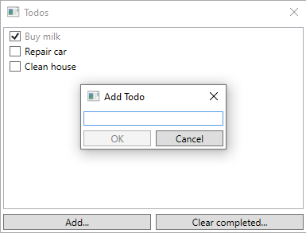

# MVVM Dialogs integrated into Windows Community Toolkit

This repository contains code integrating [MVVM Dialogs](https://github.com/FantasticFiasco/mvvm-dialogs) into a sample application built using [Windows Community Toolkit](https://github.com/CommunityToolkit/WindowsCommunityToolkit). As it normally is with software development, it's not the only way to accomplish the integration, most certainly it's not optimal for you. But it's a start...

Keep the things you like and replace the things you don't. Don't hesitate to open a new pull request if you have an opinion.

